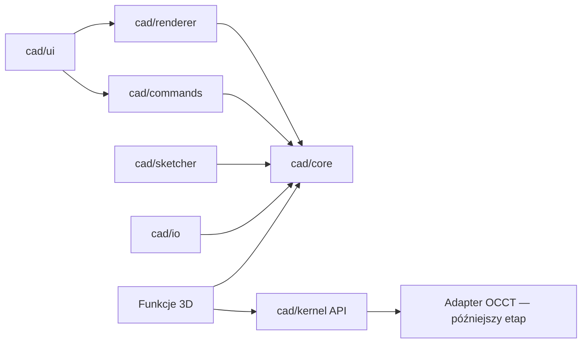

# Audyt modułu CAD w SIEKACZU 9000

Stan audytu: 2026-07-18. Dokument opisuje stan kodu źródłowego, a nie planowaną funkcjonalność.

## 1. Aktualny edytor i środowisko

SIEKACZ 9000 jest natywną aplikacją Python 3.12 / PySide6. W środowisku roboczym wykryto PySide6 6.11.1 i ezdxf 1.4.4; deklaracje dystrybucyjne to `PySide6>=6.6,<7.0`, `ezdxf>=1.3,<2.0`, ReportLab 4.x i openpyxl 3.x. Nie ma Electron, Reacta, TypeScriptu, DOM, Three.js ani backendu HTTP. Pliki są otwierane lokalnie przez `QFileDialog`, a aplikacja jest pakowana przez PyInstaller.

Główne okno produkcyjne to `app/simple_window.py`. Starsze `app/main_window.py` nie jest uruchamiane z `main.py`. Moduł rozkroju używa dataclassów z `core/models.py`, tabel Qt jako formularza wejściowego, workerów optymalizatora oraz `ui/layout_view.py` jako widoku wyniku.

Eksperymentalny edytor znajduje się w `app/technical_editor.py` i jest otwierany z tabeli formatek. Aktualnie:

- używa `QGraphicsView` / `QGraphicsScene` jako centralnego widoku 2D;
- pozwala rysować linię, prostokąt, okrąg, oznaczenie otworu i pomiar;
- ma siatkę, zoom wokół kursora, pan środkowym przyciskiem, zaznaczanie Qt i prosty snap do siatki lub końców;
- po narysowaniu linii otwiera pole długości i kąta;
- pozwala połączyć najbliższe końce dwóch linii;
- importuje bezpośrednio LINE, CIRCLE i LWPOLYLINE z DXF oraz eksportuje podstawową geometrię;
- zwraca do optymalizatora tylko bounding box całego rysunku.

Nie istnieje renderer 3D ani obsługa STEP. `import_export/dxf_io.py` jest osobnym mostem dla rozkroju: importuje DXF jako jedną prostokątną formatkę obejmującą extents, a eksportuje prostokątne płyty i formatki. Nie jest to edytowalny dokument CAD.

## 2. Problemy ergonomiczne

- Edytor jest modalnym dialogiem, nie osobnym skalowalnym obszarem roboczym z dokumentami, drzewem i właściwościami.
- Narzędzia kończą się po jednym geście i nie mają spójnego, wieloetapowego modelu Escape/prawy przycisk.
- Preselection, glify snapów, lista kandydatów i przełączanie Tab nie istnieją.
- Pole numeryczne działa tylko dla już utworzonej linii. Prostokąt nie ma precyzyjnego wprowadzania punktu, szerokości i wysokości.
- Snap do końca i snap do siatki nie są wizualnie rozróżniane; użytkownik nie wie, który kandydat zostanie użyty.
- Przesuwanie `QGraphicsItem` omija jakąkolwiek historię i nie zachowuje relacji geometrycznych.
- Zaznaczenie nie jest synchronizowane z drzewem, bo drzewa modelu nie ma.
- DXF jest wczytywany bez panelu warstw, raportu diagnostycznego i jawnego wyboru strategii importu.
- Błędy z importu są zwykle pokazywane jako surowy tekst wyjątku.

## 3. Problemy architektoniczne

Najważniejszy problem: `QGraphicsItem` jest źródłem prawdy. Współrzędne, typ geometrii, transformacja, zaznaczenie i część adnotacji mieszkają w scenie renderującej. Nie ma niezależnego, precyzyjnego modelu geometrii możliwego do serializacji i ponownego przeliczenia.

Pozostałe problemy:

- brak dokumentu CAD, hierarchii obiektów, UUID i grafu zależności;
- brak komend, transakcji i undo/redo dla operacji CAD;
- bezpośrednie mutacje elementów w procedurach UI (`setLine`, `setRect`, `setRotation`);
- snapping odczytuje geometrię z renderera, a jego wynik jest tylko punktem bez rodzaju, źródła i diagnostyki;
- brak jednostek domenowych i rozdzielonych tolerancji CAD;
- brak serializacji, wersji schematu, migracji, autosave i odzyskiwania CAD;
- importer DXF jest związany z tworzeniem elementów Qt;
- transformacje Qt mogą sprawić, że lokalna geometria i geometria sceny mają różne znaczenie;
- brak solvera więzów i stopni swobody;
- brak abstrakcji kernela B-Rep, trwałych referencji topologicznych i obliczeń poza głównym wątkiem;
- istniejące undo/redo w `SimpleCutWindow` dotyczy wyłącznie snapshotów tabeli formatek i nie nadaje się do dokumentu CAD.

## 4. Elementy nadające się do zachowania

- PySide6 i `QGraphicsView` są odpowiednie jako renderer pierwszego etapu 2D, pod warunkiem że nie przechowują modelu.
- Zoom wokół kursora, pan, adaptacyjna siatka i ciemny styl są dobrym punktem wyjścia.
- `ezdxf` jest właściwą, utrzymywaną biblioteką do zachowania prawdziwych encji DXF. Ma licencję MIT i jest już zależnością oraz częścią procesu build.
- `safe_ui_action`, dialogi plikowe, ustawienia w SQLite oraz wzorce komunikatów SIEKACZA można ponownie wykorzystać.
- Atomowy zapis przez plik tymczasowy i `replace`, użyty w historii projektów, powinien zostać zastosowany do `.siekcad`.
- Optymalizator, modele rozkroju i `LayoutView` są odseparowane funkcjonalnie od CAD i nie wymagają przepisania.
- Istniejące testy skryptowe i `QT_QPA_PLATFORM=offscreen` nadają się do testów domenowych i integracyjnych CAD.

PySide6 jest dystrybuowany na warunkach LGPLv3/GPLv3 lub licencji komercyjnej Qt, ezdxf na MIT, openpyxl na MIT, a ReportLab na BSD. Dla numerycznego solvera więzów zadeklarowano bezpośrednio NumPy 2.x, dostępne na licencji BSD-3-Clause; biblioteka była już obecna w dystrybucji jako zależność ezdxf, ale solver nie polega już na przypadkowej zależności przechodniej. Przed dołączeniem kernela OCCT trzeba osobno zweryfikować konkretny adapter, sposób linkowania/pakowania i obowiązki licencyjne; audyt nie rekomenduje jeszcze jednej implementacji.

## 5. Proponowana architektura docelowa

W Pythonie nazwy warstw będą katalogami pakietu `cad`, bez nieprawidłowych w nazwach modułów myślników:

```text
cad/
  core/          dokument, obiekty, UUID, DAG, jednostki, parametry, serializacja DTO
  sketcher/      geometria 2D, więzy, solver, snapping, diagnostyka profili
  commands/      komendy, transakcje, undo/redo, scalanie gestów
  kernel/        interfejs B-Rep i adapter wybranego kernela
  renderer/      projekcja modelu na QGraphicsScene i przyszły widok 3D
  selection/     wspólny model zaznaczenia i preselection
  io/            `.siekcad`, DXF, STEP, migracje, walidacja i autosave
  ui/            workspace Qt, drzewo, właściwości, panel zadania, status
```

Zależności mają być skierowane do środka:



Renderer otrzymuje immutable lub kontrolowane snapshoty modelu i mapuje UUID na element prezentacji. Żadna operacja edycyjna nie może uznawać współrzędnych `QGraphicsItem` za stan dokumentu. UI tworzy komendy. Komenda modyfikuje model, uruchamia inkrementalne przeliczenie i emituje zmianę; renderer tylko synchronizuje widok.

Pierwszy pionowy fragment wprowadzi dokument ze szkicem, encje linii i prostokąta, stos komend, model zaznaczenia, snap z promieniem ekranowym, numeryczne tworzenie/edycję oraz bezpieczny, wersjonowany zapis `.siekcad`.

## 6. Plan migracji bez psucia optymalizatora

1. Dodać pakiet `cad` bez zależności od `core/models.py` optymalizatora.
2. Zastąpić model sceny w `TechnicalCanvas` dokumentem CAD, zachowując wejście z `SimpleCutWindow` i zwracanie bounding boxa jako formatki.
3. Przenieść wszystkie mutacje edytora do komend i zbudować renderer UUID → `QGraphicsItem`.
4. Dodać natywny zapis/odczyt `.siekcad`, nie zmieniając formatu historii projektów rozkroju.
5. Rozszerzać sketcher i DXF za stabilnymi interfejsami; dotychczasowy `import_export/dxf_io.py` pozostawić dla raportów rozkroju.
6. Dopiero po stabilizacji 2D dodać `cad/kernel` i adapter prawdziwego B-Rep. Do tego czasu interfejs kernela może zgłaszać jawne „funkcja niedostępna”, ale nie wolno przedstawiać siatek jako brył.
7. Osobny workspace CAD może później zastąpić modalny dialog, zachowując możliwość wysłania obwiedni lub profilu do modułu rozkroju.

Każdy etap musi przechodzić dotychczasowe testy optymalizatora. Pakiet `cad` nie może importować algorytmów rozkroju, a integracja z rozkrojem ma odbywać się przez jawny wynik (wymiar/profil), nie współdzielony mutowalny stan.

## 7. Ryzyka

| Ryzyko | Skutek | Ograniczenie |
|---|---|---|
| Solver więzów jest znacznie trudniejszy niż snapping | niestabilne lub fałszywie „parametryczne” szkice | osobna warstwa solvera, testy DoF i konfliktów, brak deklarowania ukończenia bez solvera |
| Topological naming po recompute | zerwane późniejsze funkcje 3D | UUID źródła + sygnatury topologiczne + jawny stan naprawy |
| Dobór kernela i pakowanie Windows | duży rozmiar, licencja, awarie build | adapter, prototyp dystrybucji i analiza licencji przed zależnością |
| Import nieufnych DXF/STEP | DoS, uszkodzone dane, ścieżki zewnętrzne | limity, walidacja, brak wykonywania kodu, kontrolowane błędy |
| Ciężkie obliczenia w GUI | zamrożenie aplikacji | `QThreadPool`/procesy, anulowanie, generacje podglądu |
| Zbyt szybka migracja starego edytora | regresje rozkroju i utrata pracy | pionowe fragmenty, wersjonowany zapis, testy regresji, brak zmian w modelach optymalizatora |
| Utrwalenie API pierwszego prototypu | koszt późniejszej zmiany | małe interfejsy domenowe, DTO wersjonowane, brak zależności core → Qt |

## 8. Kolejność implementacji

1. Fundament: wartości 2D, tolerancje, dokument, szkic, UUID, komendy/transakcje, zaznaczenie, serializacja i migracja v1.
2. Pierwszy użyteczny sketcher: linia, prostokąt, podgląd, snap endpoint/midpoint/center/origin/grid, wartości numeryczne, delete, undo/redo, zapis/otwarcie.
3. Hierarchiczne drzewo i panel właściwości z edycją przez komendy.
4. Podstawowe więzy i solver z DoF, potem diagnostyka profilu.
5. Rozszerzone geometrie i operacje szkicu.
6. Warstwowy import/eksport DXF oraz round-trip fixtures.
7. Abstrakcja kernela, wybór i walidacja adaptera OCCT, STEP/B-Rep i tessellacja.
8. Body, historia funkcji 3D, preview/commit/cancel i trwałe referencje.
9. Funkcje zaawansowane, asynchroniczność, autosave, paleta poleceń i końcowe testy akceptacyjne.

Ten audyt nie uznaje obecnego edytora za profesjonalny CAD. Jest on użytecznym prototypem interakcji Qt, ale wymaga migracji źródła prawdy przed dalszym rozwijaniem funkcji.
